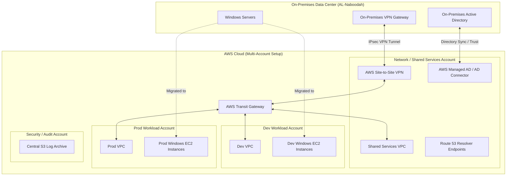

# AL-Naboodah Hybrid Multi-Account Windows Migration Infrastructure

This directory contains the Terraform configuration and modular design to support the migration of AL-Naboodah's multi-Windows server environment from on-premises to a secure, multi-account AWS environment. The infrastructure establishes hybrid connectivity via a Site-to-Site IPsec VPN and centralizes traffic routing, identity management, and auditing.

---

## 1. Migration Architecture Overview

The target AWS environment leverages a **multi-account structure** managed via AWS Organizations / AWS Control Tower. The core workloads consist of legacy and modern Windows Server machines requiring Active Directory integration.

### Architectural Blueprint


---

## 2. Directory & Module Structure

The project is structured following Terraform best practices for modular, multi-account configurations.

```text
Al-Naboodah/
├── README.md                         # Architecture design and module planning (this file)
├── terraform/                        # Root orchestrator environment
│   ├── main.tf                       # Main configuration instantiating all modules
│   ├── providers.tf                  # Multi-account AWS providers definition using AssumeRole
│   ├── variables.tf                  # Global input variables
│   ├── outputs.tf                    # Global outputs
│   └── terraform.tfvars.example      # Example values for inputs
└── modules/                          # Reusable modules
    ├── networking/                   # VPCs, subnets, route tables, Transit Gateway
    ├── vpn/                          # Customer Gateway, VPN Connection, TGW attachments
    ├── identity_directory/           # Managed Microsoft AD, DNS Resolver Endpoints & rules
    ├── compute_windows/              # Windows EC2 launch templates, ASGs, SSM integration
    └── security_governance/          # KMS keys, IAM cross-account roles, CloudTrail, Config
```

---

## 3. Primary Terraform Modules to Build

### Module 1: `networking` (VPC & Transit Gateway Integration)
* **Directory**: `modules/networking`
* **Purpose**: Sets up the VPC design across multiple accounts (Shared Services, Dev, Prod) and connects them via a central hub (AWS Transit Gateway).
* **Key Resources**:
  * `aws_vpc`: Dedicated VPCs for Shared Services, Dev workloads, and Prod workloads.
  * `aws_subnet`: Segregated public, private, and database subnets.
  * `aws_ec2_transit_gateway`: Central gateway for routing traffic between VPCs and the on-premises VPN.
  * `aws_ec2_transit_gateway_vpc_attachment`: Connects each VPC to the TGW.
  * `aws_route_table` & `aws_route`: Custom route tables to route all cross-VPC and hybrid traffic through the TGW.

### Module 2: `vpn` (Site-to-Site Hybrid Connectivity)
* **Directory**: `modules/vpn`
* **Purpose**: Establishes a secure IPsec tunnel between AL-Naboodah’s on-premises firewall and AWS.
* **Key Resources**:
  * `aws_customer_gateway`: Defines the on-premises public IP address and BGP Autonomous System Number (ASN).
  * `aws_vpn_connection`: Establishes the IPsec VPN tunnels, configured with Transit Gateway attachment.
  * `aws_ec2_transit_gateway_route_table_association` & `propagation`: Associates the VPN connection with the Transit Gateway route table and propagates routes.

### Module 3: `identity_directory` (Active Directory & Hybrid DNS)
* **Directory**: `modules/identity_directory`
* **Purpose**: Integrates AWS workloads with the AL-Naboodah Windows domain and ensures seamless DNS resolution for on-premises and AWS resources.
* **Key Resources**:
  * `aws_directory_service_directory`: Deploys AWS Managed Microsoft AD (configured as a resource forest trust) or an AD Connector to proxy authentication to on-premises domain controllers.
  * `aws_route53_resolver_endpoint` (Inbound & Outbound): Resolves queries between the on-premises `.local`/custom AD domain and AWS Route 53 Private Hosted Zones.
  * `aws_route53_resolver_rule`: Forwards DNS queries for the on-premises domain controllers across the VPN tunnel.
  * `aws_ssm_document`: Domain-join configuration script that automates joining Windows EC2 instances to the domain during boot.

### Module 4: `compute_windows` (Multi-Windows Machine Deployment)
* **Directory**: `modules/compute_windows`
* **Purpose**: Provisions Windows Server instances, handles auto-scaling, and manages remote administration safely.
* **Key Resources**:
  * `aws_instance`: Standardized Windows Server EC2 instances (e.g., Windows Server 2019/2022).
  * `aws_security_group`: Restricts inbound ports (e.g., AD ports, WinRM, RDP) to internal networks (VPC CIDRs + On-Premises subnets) and prevents public exposure.
  * `aws_iam_instance_profile` & `aws_iam_role`: Provides standard permissions for AWS Systems Manager (SSM) agent management and Active Directory domain join.
  * `aws_ssm_association`: Automatically applies the domain-join document to all target Windows machines.

### Module 5: `security_governance` (Audit, Logs & Key Management)
* **Directory**: `modules/security_governance`
* **Purpose**: Ensures compliance, encryption of resources (EBS volumes), and cross-account migration roles.
* **Key Resources**:
  * `aws_kms_key`: CMKs (Customer Managed Keys) to enforce encryption-at-rest for EBS volumes, S3 buckets, and Systems Manager logs.
  * `aws_iam_role`: Cross-account migration role configuration for AWS Application Migration Service (MGN) and SMS.
  * `aws_cloudtrail` (Organizational Trail): Deploys CloudTrail across all accounts, logging activity centrally to the Log Archive S3 bucket.

---

## 4. Port Matrix for Hybrid Windows Environments

To enable full Active Directory replication, domain join, and system administration over the VPN tunnel, the following ports must be allowed on security groups and on-premises firewalls:

| Protocol | Port | Service | Source/Destination |
| :--- | :--- | :--- | :--- |
| **UDP** | 53 | DNS | Domain Join & Name Resolution |
| **TCP** | 53 | DNS | Zone Transfers / Large Name Resolutions |
| **TCP/UDP** | 88 | Kerberos | Authentication |
| **UDP** | 123 | NTP | Time Synchronization |
| **TCP** | 135 | RPC Endpoint Mapper | Domain controller communication |
| **UDP** | 137-138 | NetBIOS Name / Datagram | Legacy NetBIOS resolution |
| **TCP** | 139 | NetBIOS Session Service | Legacy NetBIOS connectivity |
| **TCP/UDP** | 389 | LDAP | Directory queries |
| **TCP** | 445 | SMB | File shares and Group Policy retrieval |
| **TCP/UDP** | 464 | Kerberos Change/Set Password| Password management |
| **TCP** | 636 | LDAP over SSL (LDAPS) | Secure Directory queries |
| **TCP** | 3268-3269 | Global Catalog / LDAPS | Multi-domain forest queries |
| **TCP** | 5985-5986 | WinRM HTTP/HTTPS | Remote Windows management (SSM/Ansible) |
| **TCP** | 3389 | RDP | Administrative console access (strictly over VPN/Bastion) |

---

## 5. Multi-Account AWS Provider Configuration Example

To orchestrate resources across different accounts (Network/Shared-Services, Dev, Prod), the root `providers.tf` file utilizes cross-account assume-role capabilities:

```hcl
# Providers Setup (providers.tf)

terraform {
  required_providers {
    aws = {
      source  = "hashicorp/aws"
      version = "~> 4.61.0"
    }
  }
}

# 1. Management / Shared Services Provider (Default)
provider "aws" {
  region  = var.aws_region
  profile = "alnaboodah-management"
}

# 2. Developer Account Provider
provider "aws" {
  alias  = "dev"
  region = var.aws_region
  assume_role {
    role_arn     = "arn:aws:iam::DEV_ACCOUNT_ID:role/OrganizationAccountAccessRole"
    session_name = "TerraformDeploymentDev"
  }
}

# 3. Production Account Provider
provider "aws" {
  alias  = "prod"
  region = var.aws_region
  assume_role {
    role_arn     = "arn:aws:iam::PROD_ACCOUNT_ID:role/OrganizationAccountAccessRole"
    session_name = "TerraformDeploymentProd"
  }
}
```

This configuration ensures that standard resources (like computing instances or localized security groups) are provisioned directly in their designated accounts, while core networking assets (like Transit Gateway and VPN tunnels) are anchored in the central infrastructure account.
